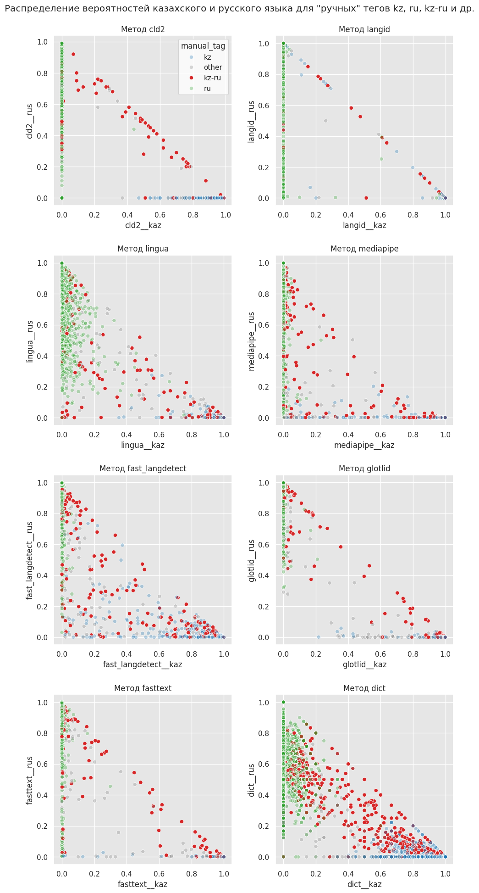

# Структура проекта
:earth_americas: For English version see [below](#project%20structure)

Репозиторий содержит блокноты с обработкой текстов, экспериментами и анализом, а также обучением моделей для потокенной разметки.

## Обработка текстов

Перечисленные ниже блокноты представляют собой 4 этапа, через которые прошли сырые тексты (не считая этапа сбора этих самых текстов), чтобы в конце концов образовался корпус KazRusCSWCorpus:

1) предобработка
2) фильтрация от "нерелевантных" текстов
3) автоматическая разметка на уровне токенов и выявление текстов с переключением кодов
4) подсчет метрик по корпусу

- `1__data_prep.ipynb` + `preprocessing.py` 

Блокнот содержит код для предобработка текстов. Он подразумевает определенную структуру хранения данных, поэтому переиспользовать его будет трудно. Однако по нему можно понять, как сырые тексты чистятся и маскируются. Основной алгоритм предобработки содержится в `preprocessing.py`.

Если кратко, то на этом этапе мы отфильтровываем все комментарии, содержащие разделительную линию, поскольку, как показал опыт, это означает, что текст представляет собой дублирование одного и того же предложения на двух языках. Затем мы избавляемся от комментариев, которые не содержат кириллических символов, маскируем эмодзи, номера банковских карт и телефонов, ссылки, хэштеги, эл. почты и упоминания. Также мы заменяем переносы строки на `\\n`, т.к. в нашем случае он приравнивается к символу окончания предложения, и заменяем все whitespace-символы на обычный пробел. Затем мы отсеиваем комментарии, которые не содержат по крайней мере трех слов, написанных на кириллице. В конце мы удаляем дубли и добавляем уникальный идентификатор к оставшимся комментариям.

В нашем случае мы изначально собрали 1,590,529 сырых текстов, и после предобработки and осталось 1,122,792 текстов.

- `2__filtering.ipynb`

В этом блокноте мы отфильтровываем все комментарии, которые по большей части не написаны на казахском или русском. Для этого мы прогоняем модель [GlotLID model](https://github.com/cisnlp/GlotLID) на комментариях и если наиболее вероятный язык не является казахским или русским, мы его откидываем.

Решение использовать именно эту модель основано на анализе, представленном в [этих блокнотах](colab_notebooks/experiments)

После этого этапа осталось 1,009,159 текстов.

- `3__token_annot.ipynb`

После этапа фильтрации мы потокенно размечаем все оставшиеся тексты с помощью дообученной модели на основе [mBERT](https://huggingface.co/liminovna/KazRusCSW-mbert) ([здесь](colab_notebooks/model_training) можно увидеть блокнот с обучением модели).

Тэгсет включает следующие модели:
- `kz` -- слово казахского языка
- `ru` -- слово русского языка
- `skz` -- слово казахского языка, транслитерированное на кириллическом алфавите
- `ambig` -- слово, существующее в обоих языках (не включает омофоны)
- `other` -- слово из другого языка
- `mixed_kz-ru` -- казахский корень/основа с русским суффиксом/окончанием
- `mixed_ru-kz` -- русский корень с казахским суффиксом/окончанием
- `univ` -- пунктуация и маски, которые мы добавили на этапе предобработки

На основе потокенной разметки мы отобрали тексты, которые содержат теги:

a) и `kz` и `ru`

b) и `skz` и `ru`

c) `mixed_kz-ru` или

d) `mixed_ru-kz`.

После этого этапа у нас осталось только 80 тыс. текстов, что составляет около 8% от данных, с которых мы начали этап.

:warning: Важно: модель плохо выявляет minority-теги, т.е. все, кроме `kz`, `ru` и `univ`, поскольку в обучающем датасете большинство токенов относилось именно к этим тегам.

- `4__metrics.ipynb`

В этом блокноте считаются метрики для корпуса:
- Average Code-Mixing Index (CMI Avg)
- Average switch-points (SP Avg)
- Multilingual Index (M-index)
- Probability of Switching (I-index)
- Burstiness
- Language Entropy (LE)
- Span Entropy (SE)

## Эксперименты и анализ

Чтобы определить лучший метод для а) фильтрации "нерелевантных" текстов и б) выявления текстов с переключением кодов основываясь только на вероятностях, возвращенных LID-моделями, мы применили и проанализировали 8 существующих LID-моделей на золотом стандарте [KazRusCSW-G-D]((https://docs.google.com/spreadsheets/d/1pIV0z6GWbt_xTweBXHIUXmU4K-84XiTseFbobv7K_xE/edit?usp=sharing)) (ссылка на google spreadsheets).

Анализируемые методы:
- cld2
- cld3
- fasttext (fast-langdetect)
- lingua
- mediapipe
- fasttext (nllb)
- fasttext (glotlid)
- словарный метод (разработан нами)

В папке `colab_notebooks/experiments` содержится два блокнота -- в первом представлен процесс обработки золотых данных 8-ю методами; во втором -- анализ результатов. В нем мы отвечаем на несколько вопросов о том, как модели реагируют на тексты определенных тегов, а также пытаемся выявить тексты с переключением, основываясь только на вероятностях для казахского и русского, которые вернули модели.

Анализ показал, что мы не можем сделать вывод о наличии переключения кодов исходя только из вероятностей. Визуализация ниже иллюстрирует, почему:



## Model training

Мы нуждались в модели, которая могла бы определять языковой тег (see the tagset [above](#text%20preprocessing)) для каждого токена в тексте. Для этого мы (до)обучили три модели: CRF, mBERT and XLM-RoBERTa. Процесс обучения см. в блокнотах `colab_notebooks/model_training/*`.

Качество получившихся моделей:
- KazRusCSW-crf
```
               precision    recall  f1-score   support

       ambig      0.672     0.558     0.610       480
          kz      0.958     0.968     0.963      5448
 mixed_kz-ru      0.909     0.263     0.408        38
 mixed_ru-kz      0.500     0.333     0.400        15
       other      0.775     0.784     0.779       268
          ru      0.964     0.982     0.973      5914
         skz      0.772     0.473     0.587       150
        univ      0.999     0.999     0.999      3201

    accuracy                          0.957     15514
   macro avg      0.819     0.670     0.715     15514
weighted avg      0.955     0.957     0.955     15514
```

- KazRusCSW-mbert
```
              precision    recall  f1-score   support

       ambig     0.5664    0.7375    0.6407       480
          kz     0.9707    0.9559    0.9633      5448
 mixed_kz-ru     0.4615    0.1579    0.2353        38
 mixed_ru-kz     0.0000    0.0000    0.0000        15
       other     0.8992    0.7985    0.8458       268
          ru     0.9644    0.9819    0.9731      5904
         skz     0.6937    0.5133    0.5900       150
        univ     0.9990    0.9803    0.9896      3200

    accuracy                         0.9542     15503
   macro avg     0.6944    0.6407    0.6547     15503
weighted avg     0.9555    0.9542    0.9541     15503
```

- KazRusCSW-xlmroberta
```
              precision    recall  f1-score   support

       ambig     0.6221    0.7167    0.6660       480
          kz     0.9669    0.9666    0.9668      5448
 mixed_kz-ru     0.0000    0.0000    0.0000        38
 mixed_ru-kz     0.0000    0.0000    0.0000        15
       other     0.6727    0.8284    0.7425       268
          ru     0.9745    0.9829    0.9787      5914
         skz     0.7320    0.4733    0.5749       150
        univ     0.9994    0.9750    0.9870      3201

    accuracy                         0.9564     15514
   macro avg     0.6209    0.6179    0.6145     15514
weighted avg     0.9552    0.9564    0.9552     15514
```

# Project structure
This repository includes notebooks for text processing, experiments and analysis, and notebooks for model training.

## Text processing

The following notebooks represent the four stages the data went through to form the KazRusCSWCorpus (not including the zero-th step which is data scraping): 
1) preprocessing, 
2) filtering out irrelevant texts, 
3) token annotation and elicitaion of code-mixed data and 
4) code-mixing metrics calculation

- `1__data_prep.ipynb` + `preprocessing.py` 

The notebook contains code for text preprocessing. It assumes a certain structure in the data so the code is not really reusable. Still, it provides an insight into how the raw texts are cleaned and sensitive data is masked. For preprocessing, the notebook uses the function from `preprocessing.py`.

Basically, during this stage, we first filter out the comments that contain a dividing line which usually indicates that the comment is just a message that is written first in one language and then translated into another. Then, we get rid of comments that do not contain any cyrillic letters, mask emoji, card and phone numbers, links, hashtags, emails and mentions. We replace newlines with `\\n` since we treat it as a meaningful token (like a full stop, for instance), and swap all the other whitespaces with a regular space. Then we filter out comments that do not contain at least three words written in cyrillic characters. Finally we drop duplicate texts and assign a uuid to each comment.

In our case, we started out with 1,590,529 texts and after preprocessing we were left with 1,122,792 texts.

- `2__filtering.ipynb`
In this notebook, we filter out texts that are not mainly in either Kazakh or Russian. We do that by running a [GlotLID model](https://github.com/cisnlp/GlotLID) on each document and if the most likely language is not Kazakh or Russian we get rid of it.

The decision to use this model specifically is based on the analysis that was carried out in the two notebooks [here](colab_notebooks/experiments)

After this step we were left with 1,009,159 texts.

- `3__token_annot.ipynb`
After filtering out irrelevant texts, we provide each document with token-level annotation using our [mBERT-based model](https://huggingface.co/liminovna/KazRusCSW-mbert) (also see [notebook](colab_notebooks/model_training) for the training details).

The tagset includes the following tags:
- `kz` -- Kazakh word
- `ru` -- Russian word
- `skz` -- Kazakh word transliterated into Cyrillic alphabeth
- `ambig` -- word that exists in both languages (context sensitive)
- `other` -- word from some other language
- `mixed_kz-ru` -- Kazakh root with Russian inflection
- `mixed_ru-kz` -- Russian root with Kazakh inflection
- `univ` -- punctuation and masks we added at the preprocessing stage

Based on the token-level annotation, we keep only those documents that include either

a) both `kz` and `ru`

b) both `skz` and `ru`

c) `mixed_kz-ru` or

d) `mixed_ru-kz`.

After this step we got to keep only 80k documents, which is about 8% of the data we started this stage with.

:warning: Note: the model does poorly at distinguishing the minority tags, which is all of them except `kz`, `ru` and `univ`, since the vast majority of the tokens in the trainig dataset had these tags. 

- `4__metrics.ipynb`

In this notebook, we calculate the following code-mixing metrics:
- Average Code-Mixing Index (CMI Avg)
- Average switch-points (SP Avg)
- Multilingual Index (M-index)
- Probability of Switching (I-index)
- Burstiness
- Language Entropy (LE)
- Span Entropy (SE)

## Experiments and analysis

To find the best method to a) filter out irrelevant texts and b) see if we can elicit texts that contain code-switching based on the probabilities the LID-models return, we applied and analyzed 8 pre-existing LID-models on the golden dataset [KazRusCSW-G-D]((https://docs.google.com/spreadsheets/d/1pIV0z6GWbt_xTweBXHIUXmU4K-84XiTseFbobv7K_xE/edit?usp=sharing)) (linked to google spreadsheets).

The methods we checked:
- cld2
- cld3
- fasttext (fast-langdetect)
- lingua
- mediapipe
- fasttext (nllb)
- fasttext (glotlid)
- dictionary-based method (self-implemented)

In the folder `colab_notebooks/experiments`, there are two notebooks -- the first one contains the application of the 8 methods to the golden data, the second one provides analysis. In the latter we try to answer a fixed set of questions regarding how the models react to documents with certain tags, and also try to elicit the documents with code-switching based purely on the probabilities of Kazakh and Russian returned by the models.

The analysis showed that we cannot infer purely from the probabilities whether the text contains code-switching. The figure below illustrates why:


## Model training

We needed a model that is able to determine the language tag (see the tagset [above](#text%20preprocessing)) for every token in text. For that, we tried three models: CRF, mBERT and XLM-RoBERTa. Details on training/finetuning can be found at `colab_notebooks/model_training`.

Here are the metrics:
- KazRusCSW-crf
```
               precision    recall  f1-score   support

       ambig      0.672     0.558     0.610       480
          kz      0.958     0.968     0.963      5448
 mixed_kz-ru      0.909     0.263     0.408        38
 mixed_ru-kz      0.500     0.333     0.400        15
       other      0.775     0.784     0.779       268
          ru      0.964     0.982     0.973      5914
         skz      0.772     0.473     0.587       150
        univ      0.999     0.999     0.999      3201

    accuracy                          0.957     15514
   macro avg      0.819     0.670     0.715     15514
weighted avg      0.955     0.957     0.955     15514
```

- KazRusCSW-mbert
```
              precision    recall  f1-score   support

       ambig     0.5664    0.7375    0.6407       480
          kz     0.9707    0.9559    0.9633      5448
 mixed_kz-ru     0.4615    0.1579    0.2353        38
 mixed_ru-kz     0.0000    0.0000    0.0000        15
       other     0.8992    0.7985    0.8458       268
          ru     0.9644    0.9819    0.9731      5904
         skz     0.6937    0.5133    0.5900       150
        univ     0.9990    0.9803    0.9896      3200

    accuracy                         0.9542     15503
   macro avg     0.6944    0.6407    0.6547     15503
weighted avg     0.9555    0.9542    0.9541     15503
```

- KazRusCSW-xlmroberta
```
              precision    recall  f1-score   support

       ambig     0.6221    0.7167    0.6660       480
          kz     0.9669    0.9666    0.9668      5448
 mixed_kz-ru     0.0000    0.0000    0.0000        38
 mixed_ru-kz     0.0000    0.0000    0.0000        15
       other     0.6727    0.8284    0.7425       268
          ru     0.9745    0.9829    0.9787      5914
         skz     0.7320    0.4733    0.5749       150
        univ     0.9994    0.9750    0.9870      3201

    accuracy                         0.9564     15514
   macro avg     0.6209    0.6179    0.6145     15514
weighted avg     0.9552    0.9564    0.9552     15514
```